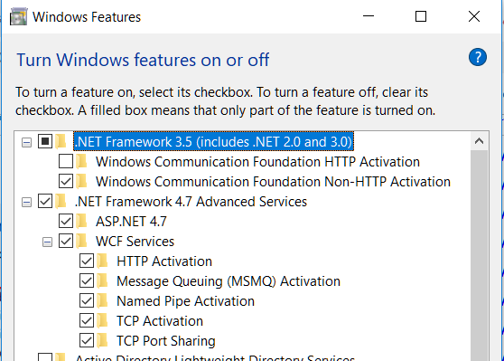
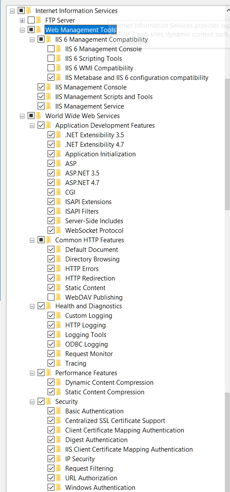
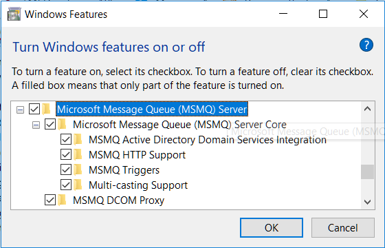
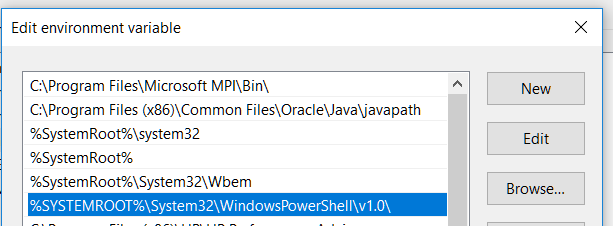
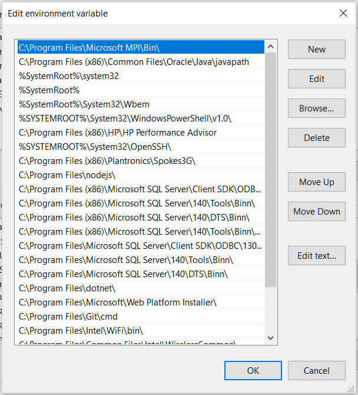

# Prerequisites

## Requirements

Before installing a developer development environment, your PC needs to satisfy the following requirements:

### Software Requirements

#### 7-Zip

It is recommended to use 7-Zip rather than Windows' native ZIP utility to extract archives.

[https://www.7-zip.org/download.html](https://www.7-zip.org/download.html)

#### Java 8 JRE (64-bit)

Download Java 8 and install it to the default directory:

[http://www.oracle.com/technetwork/java/javase/downloads/jre8-downloads-2133155.html](http://www.oracle.com/technetwork/java/javase/downloads/jre8-downloads-2133155.html)

You must set `JAVA_HOME` as a system environment variable that points to a 64-bit JRE installation.

#### Visual Studio 2015 or 2017

Requires an MSDN licence (request via helpdesk).

Install all workloads once access is granted.

#### Visual Studio Code or Atom

Code editor for development and debugging:

[https://code.visualstudio.com](https://code.visualstudio.com/)

#### Oracle Developer Tools for Visual Studio

Download the correct version for your Visual Studio installation:

[https://www.oracle.com/technetwork/developer-tools/visual-studio/downloads/index.html](https://www.oracle.com/technetwork/developer-tools/visual-studio/downloads/index.html)

#### Node.js v7.5.0 (x64)

You must download version 7.5.0 x64:

[https://nodejs.org/dist/v7.5.0/node-v7.5.0-x64.msi](https://nodejs.org/dist/v7.5.0/node-v7.5.0-x64.msi)

### Database Requirements

#### SQL Server 2017 Enterprise (optional)

Only required if using SQL Server:

[https://my.visualstudio.com/downloads](https://my.visualstudio.com/downloads)

Minimum requirement:

- Database Engine Services

#### Oracle Database 12c Release 2 (optional)

Only required if using Oracle:

[https://www.oracle.com/technetwork/database/enterprise-edition/downloads](https://www.oracle.com/technetwork/database/enterprise-edition/downloads)

#### SQL Server Management Studio 17.7

[https://docs.microsoft.com/en-us/sql/ssms/download-sql-server-management-studio-ssms](https://docs.microsoft.com/en-us/sql/ssms/download-sql-server-management-studio-ssms)

#### Oracle Instant Client

[https://www.oracle.com/technetwork/database/database-technologies/instant-client/overview/index.html](https://www.oracle.com/technetwork/database/database-technologies/instant-client/overview/index.html)

#### SQL Developer

[https://www.oracle.com/technetwork/developer-tools/sql-developer/downloads/index.html](https://www.oracle.com/technetwork/developer-tools/sql-developer/downloads/index.html)

### dbForge Studio for Oracle

[https://www.devart.com/dbforge/oracle/studio/](https://www.devart.com/dbforge/oracle/studio/)

### System Components

#### IIS URL Rewrite 2.1

[https://www.iis.net/downloads/microsoft/url-rewrite](https://www.iis.net/downloads/microsoft/url-rewrite)

If IIS features have been removed, they must be reinstalled.

#### .NET Framework 4.7

[https://www.microsoft.com/en-us/download/details.aspx?id=55168](https://www.microsoft.com/en-us/download/details.aspx?id=55168
)

## Install Required Windows Features

This topic describes how to ensure the relevant Windows features are installed.

> **Important:** Ensure that **WebDAV Publishing** is turned off.

### Steps

1. Select **Start > Windows System > Control Panel**.
2. In **Control Panel**, click **Programs > Turn Windows features on or off**.
   The **Turn Windows Features On or Off** dialog box is displayed.
3. Ensure you have Windows features set up as shown in the following screenshots:
    - Windows Features – .NET Framework
    - Windows Features – Web Management Tools
    - Windows Features – MSMQ

{ width="800" }

{ width="800" }

{ width="800" }

## Configure PowerShell

PowerShell is installed by default. Ensure that the full path to PowerShell (by default `%SYSTEMROOT%\System32\WindowsPowerShell\v1.0\`) is added to the system variable `Path`.

{ width="800" }

### Configure PowerShell execution policy

1. From the **Start** menu, search for `cmd`, right-click **Command Prompt**, and select **Run as Administrator**.

2. Run the following command:

    ```bash
    c:\windows\syswow64\WindowsPowerShell\v1.0\powershell.exe -command set-executionpolicy unrestricted
    ```

## Configuring Environment Variables on Windows

This topic describes how to configure the required environment variables for a local development environment installation.

1. Select **Start > Control Panel > System Properties > Environment Variables.**
2. In the **System variables** text box, ensure that the following system environment variables have been configured:

    | Environment Variable | Value    |
    | --------------------- | ------- |
    | JAVA_HOME | The location where Java JRE is installed; for example: `C:\Program Files\Java\jre1.8.0_144` |
    | ORACLE_HOME | The location where the Oracle database file is located. |
    | Path | See *[Path Environment Variable](#path-environment-variable)* |

### Path Environment Variable

To ensure the Path environment variable is configured correctly:

1. In the **System Variables** text box, click the **Path** variable.
2. Click the **Edit** button.
   The **Edit Environment Variable** dialog box is displayed:

    { width="800" }

3. Ensure the following paths are added to the list:

    | Value | Description |
    | ------- | ------------- |
    | `%ORACLE_HOME%\bin` | The Oracle database bin directory |
    | `c:\windows\system32\OracleClient` | The Oracle client directory |
    | `C:\Windows` | The Windows directory |
    | `C:\Windows\System32` | The Windows system directory |
    | `C:\Windows\System32\wbem` | The Windows Management Interface (WMI) directory |
    | `C:\Program Files\Microsoft MPI\bin` | The Microsoft MPI (Message Passing Interface) bin directory |
    | `%JAVA_HOME%\bin` | The Java bin directory |
