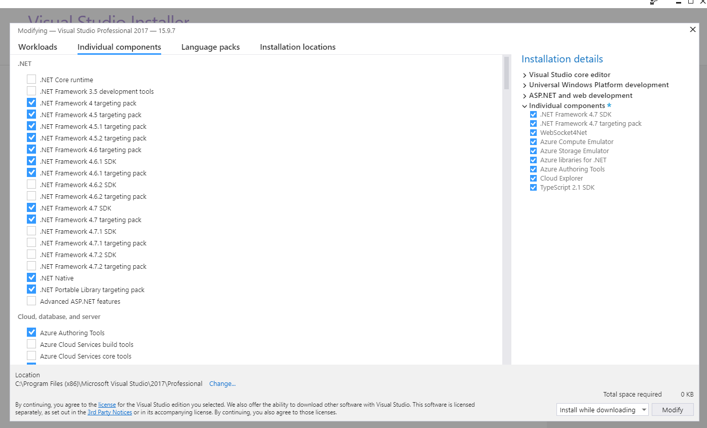
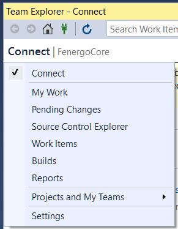

# Configuring Visual Studio .NET Framework Tools {#Configuring_Visual_Studio_.NET_Framework_Tools}

This topic describes how to configure the required .NET Framework Tools for Visual Studio. This topic assumes you have already installed Visual Studio.

1. Open Visual Studio in Administrator Mode.

2. Select **Tools > Get Tools and Features...**

    The **Visual Studio Installer** screen is displayed.

3. Click the **Individual Components** tab.

4. Ensure all .NET Framework tools are selected as shown below:

    { width="400" }
    /// caption
    Visual Studio - Individual Components Tab
    ///

5. Click **Modify**.

6. Back in the main Visual Studio window, select **Team > Manage Connections...**

    The **Team Explorer - Connect** window is displayed.

7. Click the **Connect** button.

    The following menu is displayed:

    { width="400" }
    /// caption
    Visual Studio - Team Explorer - Connect Menu
    ///

8. Select **Source Control Explorer**.

    The **Source Control Explorer** window is displayed.

9. Ensure “DEV” path for your desired project is mapped to your local directory.
